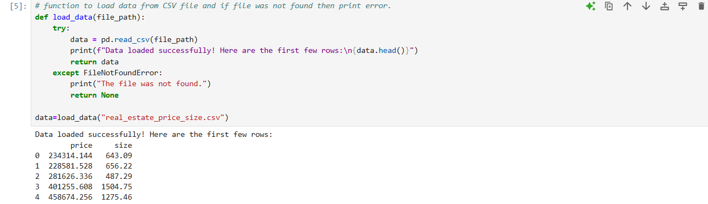
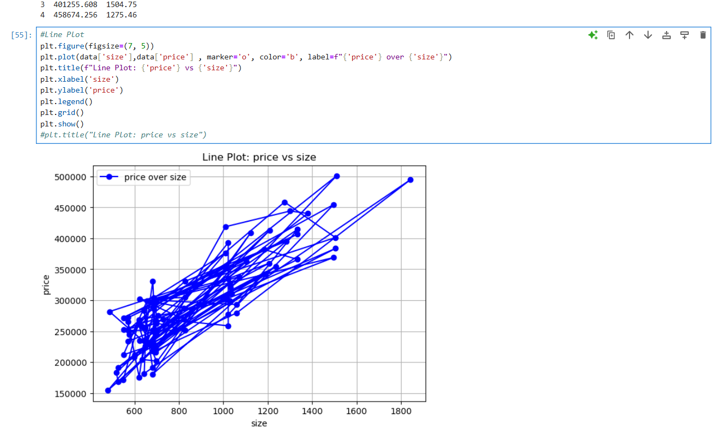
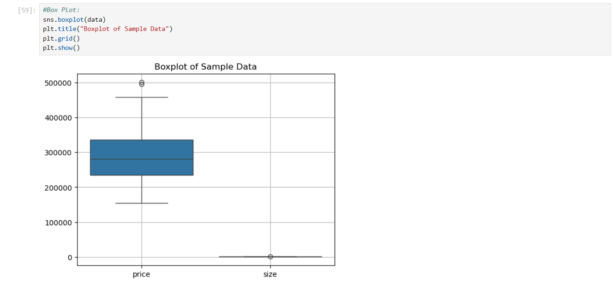
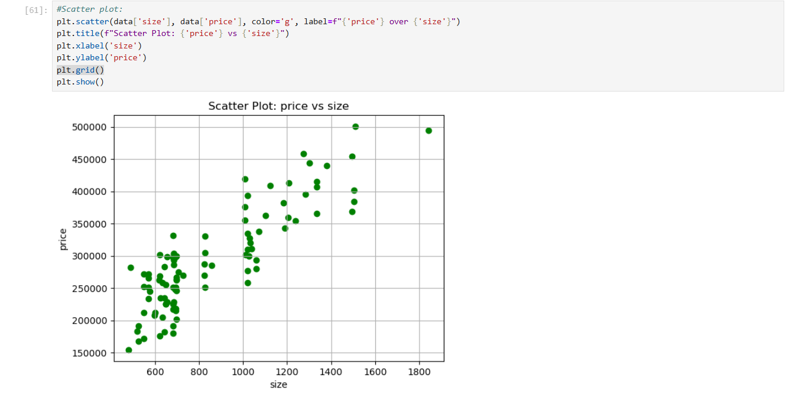
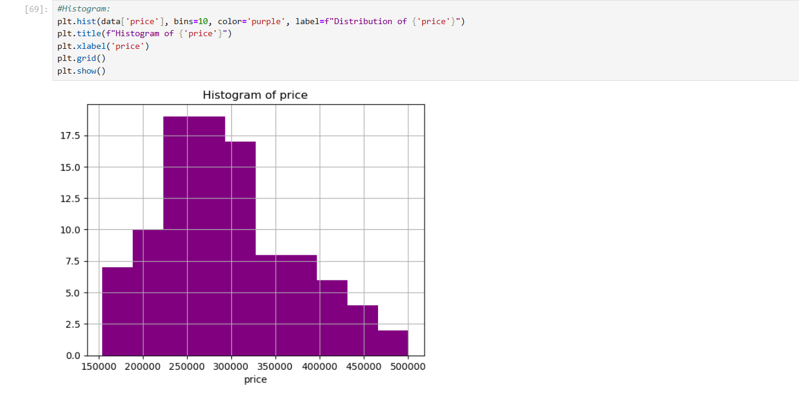

# CSV Data Visualizer

A Python-based data visualization tool that reads data from a CSV file and generates various types of plots using `pandas` and `matplotlib`. This project is designed to make it simple and interactive to explore and visualize data directly from CSV files.

---

## Features

- **Load CSV Data**: Reads data from a CSV file into a pandas DataFrame.
- **Interactive Visualization**: Prompts the user to select columns and the type of plot.
- **Multiple Plot Types**:
  - Line Plot
  - Box Plot
  - Scatter Plot
  - Histogram

---

**Technologies Used**   
	&emsp;o Python  
 	&emsp;o Pandas  
	&emsp;o Matplotlib  
 	&emsp;o GitHub Pages (for hosting project documentation)  

# Screenshots

## GUI 
    

